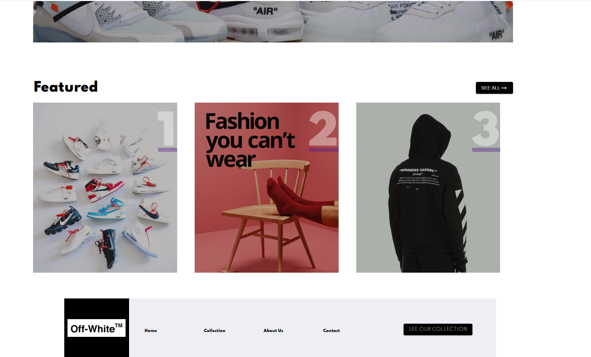

This React application combines react hooks and Material-UI grid system to deliver a professional re-imagined landing page for the Off-White brand. This was my heaviest exposure and experience with Material-UI, more than happy with how visually striking it turned out to be.

## Technologies
* JavaScript
* React
* Nodejs
* Material-UI
* AWS-Amplify

## Features
* Material-UI gridding that perfectly spaced out component contents and delivered a competent and stunning uni-directional flow.
* Custom theme breakpoints to ensure responsiveness on any device.

## Possible Future plans
* Add location information through map marker on contact page
* Auto-loop image carousel  
* Search bar for off-white products
